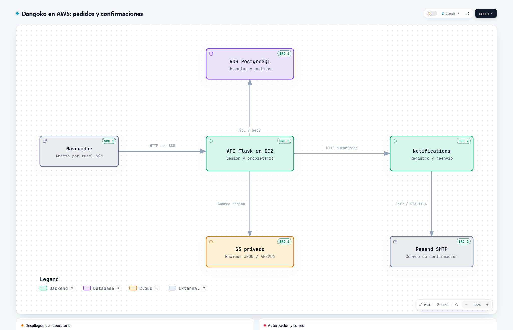

# Dangoko Marketplace — Entrega Final

Luis Antonio Hernández Vázquez · Matrícula 3101149 · LSCA2314 · Tema 3 Marketplace.

Flask y dos contenedores propios (`api` y `notifications`), con pedidos en RDS PostgreSQL y recibos privados en S3. No hay PostgreSQL local en Compose ni redirección automática a WhatsApp.

## Entrega para evaluación

Empieza por el [índice de requisitos y evidencias](docs/ENTREGA_FINAL.md).

| Requisito | Evidencia |
|---|---|
| Pipeline bloqueado en QA | [Rojo](reportes/pipeline_bloqueado.txt) y [metadata](reportes/pipeline_bloqueado_metadata.txt) |
| Tipo, severidad y falso positivo | [Clasificación](docs/clasificacion_hallazgo.md) |
| Contención y prevención | [Respuesta al incidente](docs/respuesta_incidente.md) |
| Remediación | [Commit 56b06f5](https://github.com/oft24/Proyecto-Final-Herramientas-de-tecnolog-as-de-la-informaci-n/commit/56b06f53487f5112d3d996162af672efc7e5d72e) |
| Pipeline permitido en QA | [Verde](reportes/pipeline_verde.txt) y [cierre con SHA y exit code](reportes/aws/cierre_qa.txt) |
| Nueva EC2 de Producción | [Despliegue y pruebas](docs/evidencia_produccion.md), [capturas](docs/capturas/README.md) |
| Correo real | [SMTP y confirmación del proveedor](docs/correo_confirmacion.md) |
| Infraestructura como código | [Terraform y límites](infra/README.md) |
| Uso de IA | [Declaración](docs/declaracion_ia.md) |

Los logs AWS son históricos del **29-09-2026**, no garantizan que las instancias estén encendidas ahora. Código probado y desplegado: `80a4a3b408837feb08c4097849db1660b237a6f1`. El commit posterior de cierre documental no representa un nuevo despliegue.

## Diagrama de arquitectura con Archify



[Fuente editable, visor interactivo y validación de Archify](docs/archify/README.md).

## Clonar y preparar el entorno

```bash
git clone https://github.com/oft24/Proyecto-Final-Herramientas-de-tecnolog-as-de-la-informaci-n.git
cd Proyecto-Final-Herramientas-de-tecnolog-as-de-la-informaci-n
python3.12 -m venv .venv
source .venv/bin/activate
python -m pip install -r app/requirements.txt -r pipeline/requirements-tools.txt
```

En Windows usa Python 3.12 y activa `.venv\Scripts\Activate.ps1`. Python 3.9 no es compatible con todas las herramientas fijadas.

## Docker y RDS

Usa una EC2 con acceso privado a RDS y permisos para S3. Copia `.env.example` a `.env` y completa los valores privadamente. No publiques contraseñas, cookies, tokens, `.tfvars` ni estado de Terraform.

```bash
cp .env.example .env
chmod 600 .env
# Completar configuración privada antes de continuar.
# QA: HOST_BIND=127.0.0.1, HOST_PORT=5002.
docker compose -p dangoko-final-qa up --build -d
docker compose -p dangoko-final-qa ps
curl --fail http://127.0.0.1:5002/salud
```

Producción usa su propia carpeta y proyecto `dangoko-final-prod`, puerto interno 5000. No ejecutes estos comandos en el checkout del Avance 2 ni uses `down -v`. El acceso utilizado para verificar Producción fue un túnel SSM al puerto local 5003; es acceso a EC2, no ejecución local. Para la presentación hay que preparar acceso controlado por IP pública según su consigna.

## Pruebas y pipeline

```bash
PYTHONPATH=app python -m unittest discover -s app/tests -p 'test_*.py'
python pipeline/run_pipeline.py
```

Bandit bloquea HIGH, pip-audit cualquier vulnerabilidad conocida, y una prueba fallida bloquea el conjunto. CycloneDX genera el SBOM. Los controles propios de secretos, IaC y Docker siguen documentados como propios. [Decisiones y límites](docs/tabla_decisiones_pipeline.md).

La corrida roja usa el parche vulnerable real `a4af214` en un checkout aislado de QA, no un archivo plantado ni `--demo-red`. No publiques esa versión como servicio. [Procedencia de los reportes](reportes/README.md).

## Registro, pedidos y correo

Endpoints: `POST /api/auth/register`, `POST /api/auth/login`, `POST /api/auth/logout`, `GET /api/auth/me`, `POST /api/checkout`, `GET /salud`.

El checkout valida consentimiento y carrito, escribe el recibo en S3 y persiste el pedido en RDS antes de notificar. Si RDS falla, responde 503 sin notificar; no existe una transacción distribuida S3/RDS y puede quedar un recibo huérfano.

`POST /pedidos/<codigo-BDK>/reenviar-confirmacion` permite solo al dueño autenticado solicitar confirmación. Usuario ajeno: 404. Anónimo: 401. El destinatario sale de la cuenta autenticada, no del cliente.

Sin SMTP, `delivery=recorded` es solo registro. Con SMTP, `email_sent` indica aceptación del servidor de correo. La prueba posterior con Resend reportó `delivered`; no demuestra lectura. El remitente de pruebas aún requiere un dominio verificado para destinatarios arbitrarios.

## Estado de cierre

QA roja y verde, nueva Producción, RDS/S3 y autorización tienen evidencia. La carpeta `reportes/` distingue resultados AWS de antecedentes locales. La matriz documenta lo pendiente de la plataforma y presentación; no se considera que preparar este repositorio equivalga a subir el Word o presentar.
