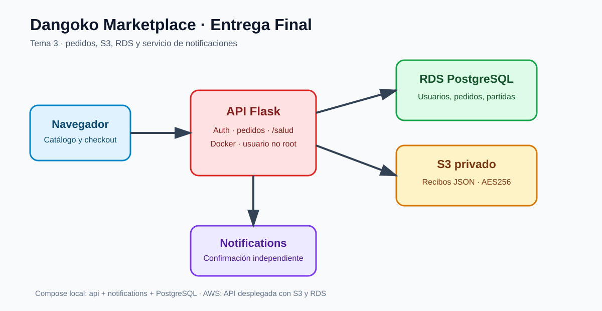

# Documentación académica

La guía principal es [ENTREGA_FINAL.md](ENTREGA_FINAL.md), con cada paso enlazado a su evidencia. [README raíz](../README.md) contiene instalación y ejecución.

## Arquitectura

El navegador accede a Flask en EC2. Compose contiene api y notifications. RDS guarda usuarios, pedidos y partidas; S3 guarda recibos privados con AES256. No hay base PostgreSQL local.

El checkout primero valida datos y crea el recibo S3, después persiste pedido/partidas en RDS, y solo entonces notifica. El reenvío exige pertenencia y utiliza SMTP cuando está configurado. [Contrato del correo](correo_confirmacion.md).

## Evaluación

- [Clasificación del hallazgo](clasificacion_hallazgo.md).
- [Contención y prevención](respuesta_incidente.md).
- [Pipeline y umbrales](tabla_decisiones_pipeline.md).
- [Producción y pruebas](evidencia_produccion.md).
- [Capturas de la plantilla](capturas/README.md).
- [Decisiones técnicas](ADR-001-decisiones-tecnicas.md).
- [Uso de IA](declaracion_ia.md).
- [Terraform](../infra/README.md).
- [Procedencia de reportes](../reportes/README.md).

Los encargos para Kiro y la guía de recuperación son documentos operativos históricos, no indicadores del estado actual. Para el cierre usa este índice y la evidencia fechada. Las pruebas no garantizan que AWS Academy permanezca encendido.
